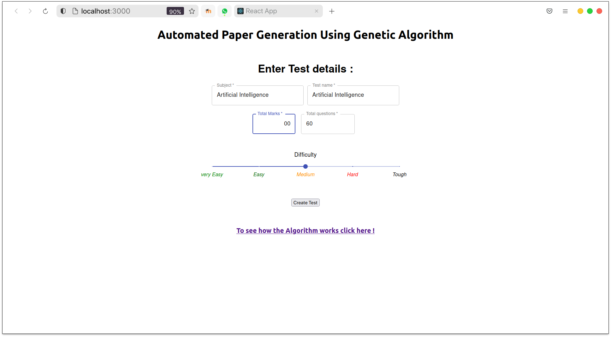
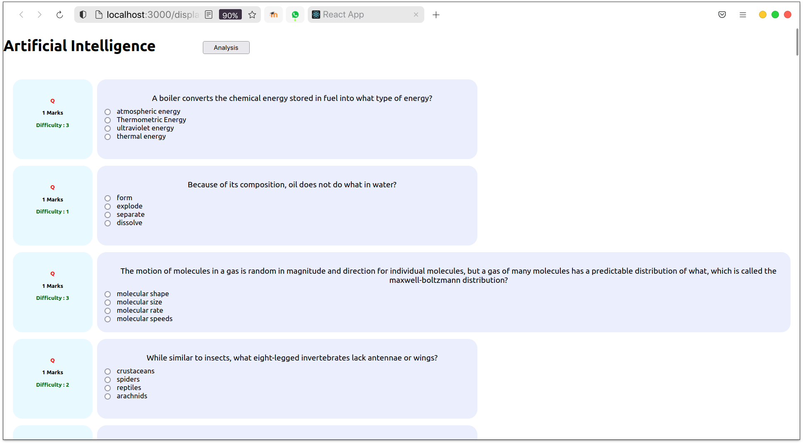
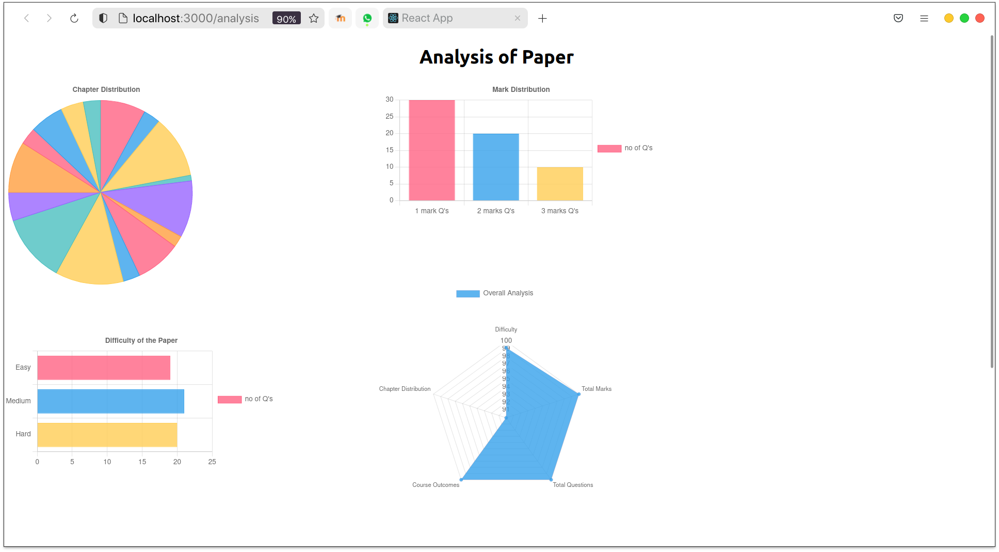
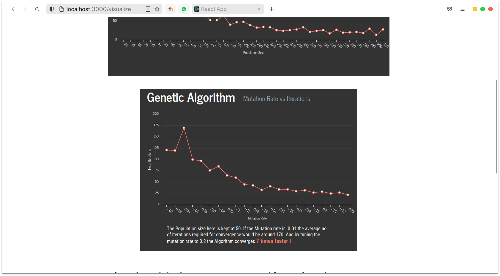
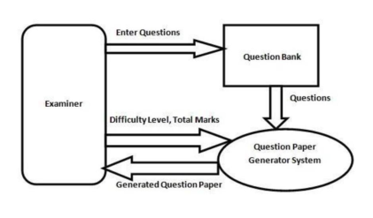
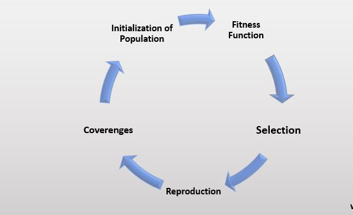

# Automated Question Paper Generation using Genetic Algorithm

## Installation

```
  sudo apt install npm
  npm i
  npm start
```

## Features

- Generate randomized question papers from question bank
- Control the difficulty of the exam
- Specify chapter distribution
- Get Analysis of the papers
- Visulization of Genetic Algorithm

## Screenshots








## Documentation

[Documentation](https://github.com/atharvamarathe/paper-generation-using_ga/blob/master/Sypnosis.pdf)

## Genetic Algorithm

### Introduction

Examination plays an important role in teaching, paperless automation test becoming increasingly
prevalent in all walks of life, rich in questions, and
Intelligent test paper generation is one of the key
steps to implement automated test.


Intelligent test paper auto-generating is of a high- quality paper which satisfy multiple constraints
set by professor after selecting questions from the bank of questions. Some algorithms have been considered, such as select-random algorithm, backtrack algorithm, and genetic algorithm.
However, they consuming lots of time and space in the condition of much questions. Genetic algorithm is a natural evolutionary process simulation model which have the characteristics of concurrency, intelligent search, robust, simplicity.

### Description

A genetic algorithm is a search heuristic that is
inspired by Charles Darwin’s theory of natural
evolution. This algorithm reflects the process of
natural selection where the fittest individuals are
selected for reproduction in order to produce
offspring of the next generation.
The process of natural selection starts with the
selection of fittest individuals from a population.
They produce offspring which inherit the
characteristics of the parents and will be added to
the next generation. If parents have better fitness,
their offspring will be better than parents and
have better chance at surviving.


This process keeps on iterating and at the end, a
generation with the fittest individuals will be
found. This notion can be applied for a search
problem. We consider a set of solutions for a
problem and select the set of best ones out of
them.
Five phases are considered in a genetic algorithm.

- Initial Population
- Fitness Function
- Selection
- Crossover
- Mutation
